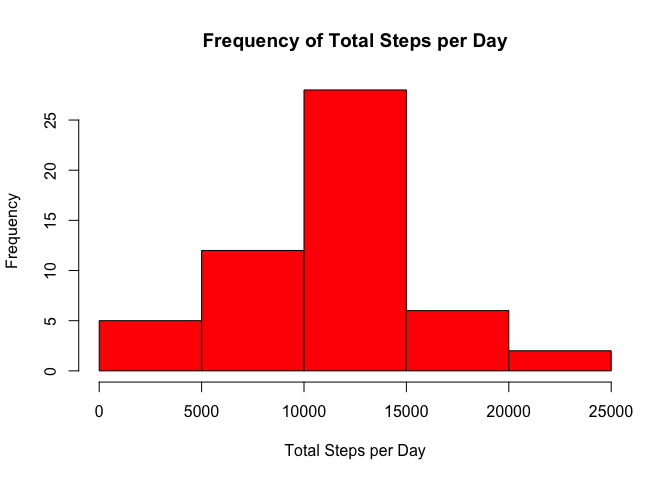
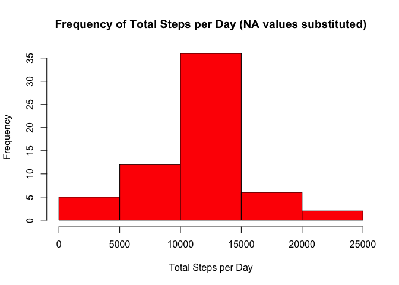

# Reproducible Research: Peer Assessment 1
## Loading and preprocessing the data
**Show any code that is needed to**

*1. Load the data (i.e. read.csv())*


```r
# Download the data from the original data source and load into data frame
url <- "https://d396qusza40orc.cloudfront.net/repdata%2Fdata%2Factivity.zip"
temp <- tempfile()
download.file(url, temp, method="curl")
file <- unz(temp, "activity.csv")
data <- read.csv(file , as.is=TRUE)
unlink(temp)
```

*2. Process/transform the data (if necessary) into a format suitable for your analysis*


```r
# Add a timestamp column
data$time <- sprintf('%04d', data$interval)
data$time <- sub("([0-9]{2,2})$", ":\\1", data$time)
data$timestamp <- as.numeric(as.POSIXct(sprintf("%s %s", data$date, data$time)))
```

## What is mean total number of steps taken per day?

*For this part of the assignment, you can ignore the missing values in the dataset.*

*1. Make a histogram of the total number of steps taken each day*


```r
steps_per_day <- aggregate(data$steps, by=list(date=data$date), FUN=sum)
hist(steps_per_day$x,
   col=c("red"),
	 main="Frequency of Total Steps per Day",
	 xlab="Total Steps per Day",
	 ylab="Frequency")
```

 

*2. Calculate and report the mean and median total number of steps taken per day*


```r
# Mean
mean(steps_per_day$x, na.rm=TRUE)
```

```
## [1] 10766.19
```

```r
# Median
median(steps_per_day$x, na.rm=TRUE)
```

```
## [1] 10765
```

## What is the average daily activity pattern?

*1. Make a time series plot (i.e. type = "l") of the 5-minute interval (x-axis) and the average number of steps taken, averaged across all days (y-axis)*


```r
# First, use aggregate to find the mean.
activity_pattern <- aggregate(steps ~ interval, data, mean)
# Now plot a time series
plot(activity_pattern$interval,
	 activity_pattern$steps,
	 type = "l",
	 xlab="Interval",
	 ylab="Average number of steps taken",
	 main="Average number of steps taken vs. 5-minute interval")
```

 

*2. Which 5-minute interval, on average across all the days in the dataset, contains the maximum number of steps?*


```r
max_interval <- activity_pattern[which.max(activity_pattern$steps), "interval"]
```

## Imputing missing values

*Note that there are a number of days/intervals where there are missing values (coded as NA). The presence of missing days may introduce bias into some calculations or summaries of the data.*

*1. Calculate and report the total number of missing values in the dataset (i.e. the total number of rows with NAs)*


```r
total_missing_values <- sum(is.na(data$steps))
```

*2. Devise a strategy for filling in all of the missing values in the dataset. The strategy does not need to be sophisticated. For example, you could use the mean/median for that day, or the mean for that 5-minute interval, etc.*

Since the instructions explicitly said the strategy does not need to be sophisticated, we will use the mean for the 5-minute interval as a substitute for NA values. A more sophisticated strategy might be to average the data points before and after, and use 0 for the inital NA values.

*3. Create a new dataset that is equal to the original dataset but with the missing data filled in.*


```r
new_data <- data
new_data$steps <- ifelse(is.na(new_data$steps),
				 activity_pattern$steps,
				 new_data$steps)
```

*4. Make a histogram of the total number of steps taken each day and Calculate and report the mean and median total number of steps taken per day. Do these values differ from the estimates from the first part of the assignment? What is the impact of imputing missing data on the estimates of the total daily number of steps?*


```r
new_steps_per_day <- aggregate(new_data$steps, by=list(date=new_data$date), FUN=sum)
hist(new_steps_per_day$x,
	 col=c("red"),
	 main="Frequency of Total Steps per Day (NA values substituted)",
	 xlab="Total Steps per Day",
	 ylab="Frequency")
```

 

```r
# New mean
mean(new_steps_per_day$x, na.rm=TRUE)
```

```
## [1] 10766.19
```

```r
# New median
median(new_steps_per_day$x, na.rm=TRUE)
```

```
## [1] 10766.19
```

```r
# Impact of replacing NA values on mean
mean(new_steps_per_day$x, na.rm=TRUE) - mean(steps_per_day$x, na.rm=TRUE)
```

```
## [1] 0
```

```r
# Impact of replacing NA values on median
median(new_steps_per_day$x, na.rm=TRUE) - median(steps_per_day$x, na.rm=TRUE)
```

```
## [1] 1.188679
```

As shown above, replacing NA values does not affect the mean, but does affect the median (increasing by roughly 1.2)

## Are there differences in activity patterns between weekdays and weekends?

*For this part the weekdays() function may be of some help here. Use the dataset with the filled-in missing values for this part.*

*1. Create a new factor variable in the dataset with two levels – “weekday” and “weekend” indicating whether a given date is a weekday or weekend day.*


```r
new_data$weekday <- ifelse(
	weekdays(as.Date(new_data$date)) %in% c("Saturday", "Sunday"),
	"weekend",
	"weekday")
new_data$weekday <- as.factor(new_data$weekday)
```

*2. Make a panel plot containing a time series plot (i.e. type = "l") of the 5-minute interval (x-axis) and the average number of steps taken, averaged across all weekday days or weekend days (y-axis). See the README file in the GitHub repository to see an example of what this plot should look like using simulated data.*


```r
new_activity_pattern <- aggregate(steps ~ interval+weekday, new_data, mean)
library(lattice)
xyplot(steps ~ interval | weekday,
       new_activity_pattern,
       type = "l",
       layout = c(1, 2),
       xlab = "Interval",
       ylab = "Number of steps")
```

 

